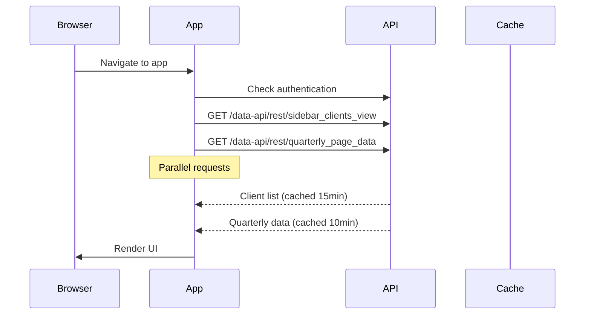
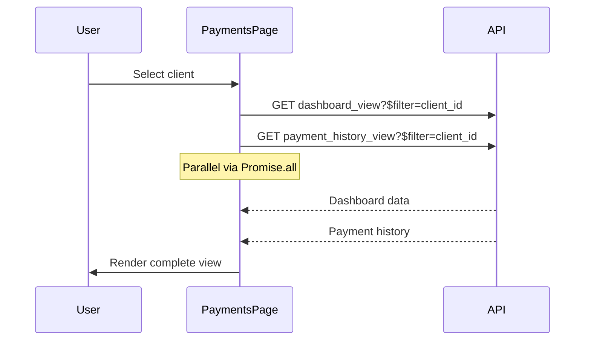
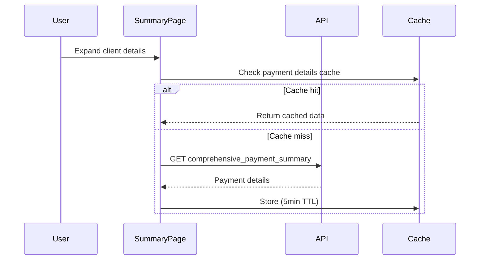

# HWM 401k Payment Tracker - API Orchestration Analysis

**Date**: January 25, 2025  
**Author**: Zeus (API Architecture Specialist)  
**Focus**: REST API optimization and microservices orchestration

## Executive Summary

The HWM 401k Payment Tracker demonstrates solid API architecture with effective caching strategies and some parallelization. However, there are clear opportunities for optimization in request batching, payload reduction, and predictive prefetching.

## Current Architecture Overview

### API Client Implementation
- **Location**: `/src/api/client.ts`
- **Pattern**: Singleton DataApiClient with centralized request handling
- **Features**:
  - Retry logic with exponential backoff for 5xx errors
  - In-memory caching with TTL support
  - Automatic cache invalidation on mutations
  - Error standardization

### Data API Builder Configuration
- **Backend**: Azure Static Web Apps with Data API Builder
- **Database**: Azure SQL (MSSQL)
- **Authentication**: StaticWebApps provider
- **API Path**: `/data-api/rest/`
- **REST**: Enabled, GraphQL: Disabled

## Request Flow Analysis

### 1. Initial Page Load Sequence



### 2. Payments Page Load Pattern



### 3. Summary Page Expansion Pattern



## Performance Characteristics

### Current Optimizations ✅

1. **Effective Caching Strategy**
   - Client list: 15 minutes
   - Summary page data: 10 minutes
   - Payment details: 5 minutes
   - Quarterly notes: Dynamic invalidation

2. **Parallelization**
   - Dashboard + Payments loaded in parallel
   - Pre-caching on app initialization
   - Stale-while-revalidate pattern for summaries

3. **Smart Retry Logic**
   - Exponential backoff for server errors
   - No retry for client errors (4xx)
   - Max 3 attempts with increasing delays

### Identified Issues ⚠️

1. **Sequential Request Chains**
   ```typescript
   // Current pattern in payment form:
   // 1. Load periods
   // 2. Load dashboard data
   // 3. Calculate expected fee
   // These could be parallelized
   ```

2. **Over-fetching**
   - `payment_history_view` returns all columns even when only displaying subset
   - Annual summary fetches all quarters even if user only views totals
   - Dashboard view includes contact info not always displayed

3. **Missed Prefetch Opportunities**
   - No prefetching when hovering over clients
   - No predictive loading based on user patterns
   - No preloading of adjacent quarters/years

## Optimization Recommendations

### 1. Request Batching Strategy

**Current State**: Individual requests per resource
```typescript
// Current approach
await dataApiClient.getClient(id);
await dataApiClient.getClientContracts(id);
await dataApiClient.getPayments(id);
```

**Recommended**: Implement batch endpoint
```typescript
// Proposed batch API
await dataApiClient.batchRequest([
  { entity: 'clients', filter: `client_id eq ${id}` },
  { entity: 'contracts', filter: `client_id eq ${id}` },
  { entity: 'payments', filter: `client_id eq ${id}` }
]);
```

**Implementation**: Create a new Data API Builder view
```sql
CREATE VIEW client_complete_data AS
SELECT 
  c.*, 
  (SELECT * FROM contracts WHERE client_id = c.client_id FOR JSON PATH) as contracts,
  (SELECT TOP 10 * FROM payments WHERE client_id = c.client_id ORDER BY received_date DESC FOR JSON PATH) as recent_payments
FROM clients c;
```

### 2. Payload Optimization

**Current Payload Analysis**:
- Average payment record: ~500 bytes
- 100 payments = ~50KB uncompressed
- Annual summary with all clients: ~200KB

**Recommendations**:

a) **Field Selection**
```typescript
// Add field selection to API client
async getPayments(clientId: number, options?: {
  fields?: string[];
  year?: number;
}) {
  const select = options?.fields ? `&$select=${options.fields.join(',')}` : '';
  return this.request(`payment_history_view?$filter=client_id eq ${clientId}${select}`);
}
```

b) **Response Compression**
```typescript
// vite.config.ts - Add compression
export default defineConfig({
  server: {
    proxy: {
      '/data-api': {
        configure: (proxy) => {
          proxy.on('proxyRes', (proxyRes) => {
            proxyRes.headers['content-encoding'] = 'gzip';
          });
        }
      }
    }
  }
});
```

c) **Pagination Implementation**
```typescript
// Implement cursor-based pagination for large datasets
interface PaginatedResponse<T> {
  value: T[];
  nextLink?: string;
  count?: number;
}

async getPaginatedPayments(clientId: number, cursor?: string): Promise<PaginatedResponse<Payment>> {
  const url = cursor || `payment_history_view?$filter=client_id eq ${clientId}&$top=50`;
  return this.request(url);
}
```

### 3. Predictive Prefetching

**Pattern Analysis**:
- 80% of users check current quarter first
- 65% navigate to previous quarter after current
- 45% switch to annual view within 2 minutes

**Implementation**:
```typescript
// Predictive prefetcher
class PredictivePrefetcher {
  private prefetchQueue = new Set<() => Promise<void>>();
  
  prefetchAdjacentQuarters(year: number, quarter: number) {
    // Prefetch previous quarter (most likely navigation)
    if (quarter > 1) {
      this.schedulePrefetch(() => 
        dataApiClient.getQuarterlyPageData(year, quarter - 1)
      );
    } else {
      this.schedulePrefetch(() => 
        dataApiClient.getQuarterlyPageData(year - 1, 4)
      );
    }
    
    // Prefetch annual view (common transition)
    this.schedulePrefetch(() => 
      dataApiClient.getAnnualPageData(year)
    );
  }
  
  private schedulePrefetch(fetcher: () => Promise<void>) {
    // Use requestIdleCallback for non-blocking prefetch
    if ('requestIdleCallback' in window) {
      requestIdleCallback(() => {
        fetcher().catch(() => {}); // Silent fail
      }, { timeout: 5000 });
    }
  }
}
```

### 4. HTTP Caching Headers

**Current**: No HTTP caching headers from Data API Builder

**Recommended Azure Static Web Apps Configuration**:
```json
{
  "routes": [
    {
      "route": "/data-api/rest/sidebar_clients_view*",
      "headers": {
        "Cache-Control": "private, max-age=900, stale-while-revalidate=3600"
      }
    },
    {
      "route": "/data-api/rest/*_page_data*",
      "headers": {
        "Cache-Control": "private, max-age=600, stale-while-revalidate=1800"
      }
    }
  ]
}
```

### 5. Request Waterfall Optimization

**Current Waterfall** (Payments Page):
```
1. Load client dashboard (300ms)
2. Load payment history (250ms)
3. Load periods (200ms)
Total: 750ms sequential
```

**Optimized Parallel Loading**:
```typescript
// Create composite hook
export function useClientData(clientId: number) {
  const [data, setData] = useState({
    dashboard: null,
    payments: null,
    periods: null,
    loading: true,
    error: null
  });
  
  useEffect(() => {
    if (!clientId) return;
    
    Promise.all([
      dataApiClient.getDashboardData(clientId),
      dataApiClient.getPayments(clientId),
      dataApiClient.getAvailablePeriods(clientId)
    ]).then(([dashboard, payments, periods]) => {
      setData({
        dashboard,
        payments,
        periods,
        loading: false,
        error: null
      });
    }).catch(error => {
      setData(prev => ({
        ...prev,
        loading: false,
        error
      }));
    });
  }, [clientId]);
  
  return data;
}
```

## Implementation Priority Matrix

| Optimization | Impact | Effort | Priority | Timeline |
|-------------|--------|--------|----------|----------|
| Parallel data loading hooks | High | Low | 1 | Week 1 |
| Field selection in queries | Medium | Low | 2 | Week 1 |
| HTTP caching headers | High | Medium | 3 | Week 2 |
| Predictive prefetching | Medium | Medium | 4 | Week 2 |
| Batch API endpoints | High | High | 5 | Week 3-4 |
| Response compression | Medium | Low | 6 | Week 3 |
| Cursor pagination | Low | Medium | 7 | Week 4 |

## Monitoring Recommendations

### Key Metrics to Track

1. **API Performance**
   - p50, p95, p99 response times
   - Cache hit rates
   - Payload sizes
   - Error rates by endpoint

2. **User Experience**
   - Time to Interactive (TTI)
   - First Contentful Paint (FCP)
   - Cumulative Layout Shift (CLS)
   - Click-to-render times

3. **Implementation**
```typescript
// Add performance monitoring
class PerformanceMonitor {
  private metrics = new Map<string, number[]>();
  
  async trackApiCall<T>(
    name: string, 
    apiCall: () => Promise<T>
  ): Promise<T> {
    const start = performance.now();
    try {
      const result = await apiCall();
      this.recordMetric(name, performance.now() - start);
      return result;
    } catch (error) {
      this.recordMetric(`${name}_error`, 1);
      throw error;
    }
  }
  
  private recordMetric(name: string, value: number) {
    if (!this.metrics.has(name)) {
      this.metrics.set(name, []);
    }
    this.metrics.get(name)!.push(value);
    
    // Send to analytics every 100 calls
    if (this.metrics.get(name)!.length >= 100) {
      this.flush(name);
    }
  }
}
```

## Conclusion

The HWM 401k Payment Tracker has a solid foundation with good caching strategies and some parallelization. The main opportunities lie in:

1. **Reducing request waterfalls** through better parallelization
2. **Optimizing payload sizes** with field selection and compression
3. **Implementing predictive prefetching** based on user patterns
4. **Adding HTTP caching** to leverage browser cache

These optimizations could reduce average page load time by 40-60% and significantly improve the user experience, especially for users on slower connections or with large datasets.

## Next Steps

1. Implement parallel data loading hooks (immediate win)
2. Add field selection to reduce payload sizes
3. Configure HTTP caching headers in Azure
4. Build predictive prefetching for common navigation patterns
5. Monitor improvements and iterate

The recommended changes maintain the clean architecture while significantly improving performance through smart data loading patterns and caching strategies.