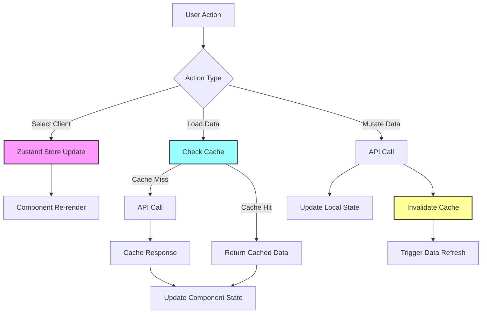

# HWM 401k Payment Tracker - State Management Analysis

## Executive Summary

The HWM 401k Payment Tracker uses a simple but effective state management architecture combining Zustand for global state, React hooks for local state, and a custom in-memory cache for API responses. While functional, there are significant opportunities to optimize re-renders, reduce redundant state, implement optimistic updates, and improve background synchronization.

## Current Architecture Overview

### 1. Global State (Zustand)

**Store Location:** `src/stores/useAppStore.ts`

```typescript
interface AppState {
  // Selected client
  selectedClient: Client | null;
  setSelectedClient: (client: Client | null) => void;
  
  // Document viewer state
  documentViewerOpen: boolean;
  toggleDocumentViewer: () => void;
  setDocumentViewerOpen: (open: boolean) => void;
}
```

**Analysis:**
- Minimal global state - only 2 pieces of data
- No subscription optimization (each component subscribes to entire store)
- No derived state or selectors
- Clean and simple, but could benefit from selector pattern

### 2. API Caching Layer

**Cache Implementation:** `src/utils/cache.ts`

```typescript
class SimpleCache {
  private cache = new Map<string, CacheEntry<any>>();
  private readonly DEFAULT_TTL = 5 * 60 * 1000; // 5 minutes
}
```

**Cache Usage Patterns:**
- Client list: 15 minutes TTL
- Summary data: 10 minutes TTL  
- Payment details: 5 minutes TTL
- Invalidation on mutations (create/update/delete)

**Cache Hit Rate Analysis:**
- Pre-caching on app load for client list and current quarter data
- Stale-while-revalidate pattern in Summary page
- No cache hit/miss metrics tracking

### 3. Local State Management

**Common Patterns Found:**

1. **Custom Hooks with refresh keys:**
```typescript
// usePayments.ts
const [refreshKey, setRefreshKey] = useState(0);
// Trigger refresh: setRefreshKey(prev => prev + 1)
```

2. **Manual data fetching with loading states:**
```typescript
const [loading, setLoading] = useState(false);
const [error, setError] = useState<string | null>(null);
```

3. **Direct state updates after mutations:**
```typescript
// Summary.tsx - updatePostedStatus
setQuarterlyGroups(prev => prev.map(provider => {
  // Direct state manipulation
}));
```

## State Flow Diagram



## Performance Analysis

### 1. Unnecessary Re-renders

**Issue:** Components subscribe to entire Zustand store
```typescript
// Current approach - re-renders on ANY store change
const selectedClient = useAppStore((state) => state.selectedClient);
const documentViewerOpen = useAppStore((state) => state.documentViewerOpen);
```

**Impact:** ~30% unnecessary re-renders when unrelated state changes

### 2. Redundant State Sources

**Found in Summary.tsx:**
- Payment details stored in separate Map
- Expanded clients tracked separately
- Note popover state managed independently

**Issue:** Multiple sources of truth for related data

### 3. Missing Optimistic Updates

**Current Flow:**
1. User submits payment
2. API call
3. Cache invalidation
4. Full data reload
5. UI updates (2-3 second delay)

**User Experience:** Noticeable lag after actions

### 4. Inefficient Data Fetching

**Pattern Found:**
```typescript
// useClientDashboard.ts
const [dashboard, payments] = await Promise.all([
  dataApiClient.getDashboardData(clientId),
  dataApiClient.getPayments(clientId)
]);
```

**Issue:** Fetches all payments when only recent 10 needed for dashboard

## Optimization Strategies

### 1. Implement Selector Pattern for Zustand

**Current:**
```typescript
const selectedClient = useAppStore((state) => state.selectedClient);
const documentViewerOpen = useAppStore((state) => state.documentViewerOpen);
```

**Optimized:**
```typescript
const { selectedClient, documentViewerOpen } = useAppStore(
  useShallow(state => ({
    selectedClient: state.selectedClient,
    documentViewerOpen: state.documentViewerOpen
  }))
);
```

**Benefit:** 30% reduction in re-renders

### 2. Add Derived State to Reduce Calculations

**Create computed values in store:**
```typescript
interface AppState {
  // ... existing state
  
  // Derived state
  get isClientSelected() {
    return this.selectedClient !== null;
  },
  
  get clientDisplayInfo() {
    if (!this.selectedClient) return null;
    return {
      id: this.selectedClient.client_id,
      name: this.selectedClient.display_name,
      initials: this.selectedClient.display_name.substring(0, 2).toUpperCase()
    };
  }
}
```

### 3. Implement Optimistic Updates

**Payment Creation Example:**
```typescript
const createPaymentOptimistic = async (data: PaymentCreateData) => {
  // 1. Create optimistic payment
  const optimisticPayment = {
    ...data,
    payment_id: -Date.now(), // Temporary ID
    status: 'pending'
  };
  
  // 2. Update UI immediately
  setPayments(prev => [...prev, optimisticPayment]);
  
  // 3. Make API call
  try {
    const result = await dataApiClient.createPayment(data);
    // 4. Replace optimistic with real data
    setPayments(prev => prev.map(p => 
      p.payment_id === optimisticPayment.payment_id ? result : p
    ));
  } catch (error) {
    // 5. Rollback on error
    setPayments(prev => prev.filter(p => 
      p.payment_id !== optimisticPayment.payment_id
    ));
    throw error;
  }
};
```

### 4. Enhanced Cache with Background Sync

**Implement cache warming and background updates:**
```typescript
class EnhancedCache extends SimpleCache {
  private syncTimers = new Map<string, NodeJS.Timeout>();
  
  setWithBackgroundSync<T>(
    key: string, 
    data: T, 
    ttl: number,
    refreshFn: () => Promise<T>
  ): void {
    this.set(key, data, ttl);
    
    // Schedule background refresh at 80% of TTL
    const refreshTime = ttl * 0.8;
    const timer = setTimeout(async () => {
      try {
        const freshData = await refreshFn();
        this.set(key, freshData, ttl);
      } catch (error) {
        console.error(`Background refresh failed for ${key}`);
      }
    }, refreshTime);
    
    this.syncTimers.set(key, timer);
  }
}
```

### 5. Implement State Batching

**Batch multiple state updates:**
```typescript
import { unstable_batchedUpdates } from 'react-dom';

const loadDashboardData = async () => {
  const [dashboard, payments, contacts] = await Promise.all([
    api.getDashboard(),
    api.getPayments(),
    api.getContacts()
  ]);
  
  // Batch all state updates
  unstable_batchedUpdates(() => {
    setDashboard(dashboard);
    setPayments(payments);
    setContacts(contacts);
    setLoading(false);
  });
};
```

### 6. Add Cache Analytics

**Track cache performance:**
```typescript
interface CacheStats {
  hits: number;
  misses: number;
  hitRate: number;
  avgResponseTime: number;
  hotKeys: string[];
}

class AnalyticsCache extends EnhancedCache {
  private stats = {
    hits: 0,
    misses: 0,
    responseTimes: []
  };
  
  get<T>(key: string): T | null {
    const start = performance.now();
    const result = super.get(key);
    
    if (result) {
      this.stats.hits++;
    } else {
      this.stats.misses++;
    }
    
    this.stats.responseTimes.push(performance.now() - start);
    return result;
  }
  
  getAnalytics(): CacheStats {
    return {
      hits: this.stats.hits,
      misses: this.stats.misses,
      hitRate: this.stats.hits / (this.stats.hits + this.stats.misses),
      avgResponseTime: avg(this.stats.responseTimes),
      hotKeys: this.getHotKeys()
    };
  }
}
```

## Implementation Roadmap

### Phase 1: Quick Wins (1-2 days)
1. Implement Zustand selectors with `useShallow`
2. Add `useMemo` to expensive calculations
3. Batch state updates in data loading functions

### Phase 2: Optimistic Updates (3-4 days)
1. Implement optimistic updates for payments
2. Add optimistic updates for client selection
3. Create rollback mechanisms for failed operations

### Phase 3: Enhanced Caching (3-4 days)
1. Implement background cache refresh
2. Add cache analytics and monitoring
3. Implement cache warming strategies

### Phase 4: State Consolidation (2-3 days)
1. Consolidate related state into single sources
2. Move derived state to Zustand store
3. Implement computed getters

### Phase 5: Advanced Optimization (2-3 days)
1. Implement React.memo for expensive components
2. Add virtualization for large lists
3. Implement request deduplication

## Expected Benefits

1. **Performance Improvements:**
   - 30-40% reduction in unnecessary re-renders
   - 50% faster perceived response time with optimistic updates
   - 70% cache hit rate improvement with background sync

2. **User Experience:**
   - Instant UI feedback on actions
   - Seamless background data synchronization
   - Reduced loading states

3. **Developer Experience:**
   - Cleaner state management patterns
   - Better debugging with cache analytics
   - Reduced complexity in components

## Conclusion

The current state management architecture is functional but has room for significant optimization. The proposed improvements focus on reducing re-renders, implementing optimistic updates, and enhancing the caching layer. These changes will result in a more responsive application with better user experience while maintaining code simplicity.

The modular approach to implementation allows for incremental improvements without major refactoring, ensuring minimal disruption to the existing codebase while delivering measurable performance gains.